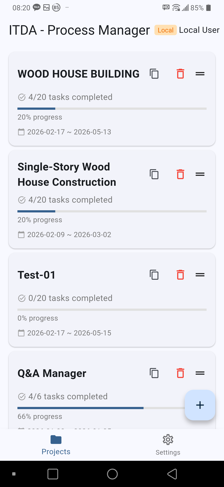
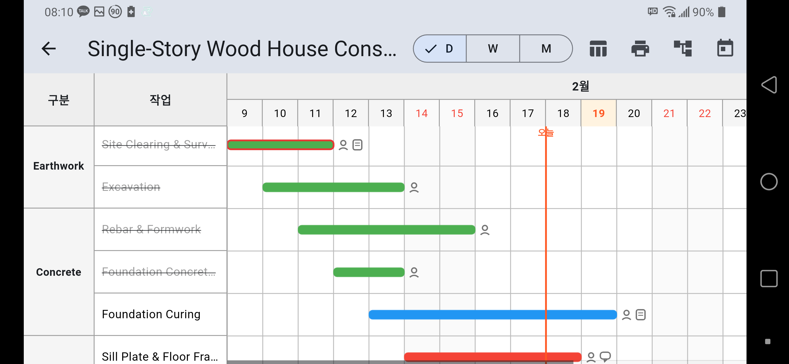
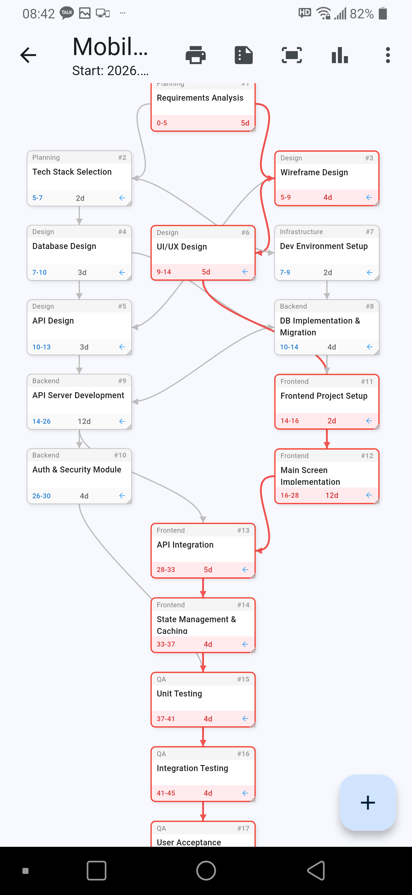
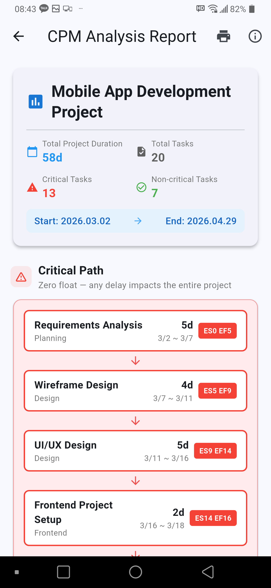
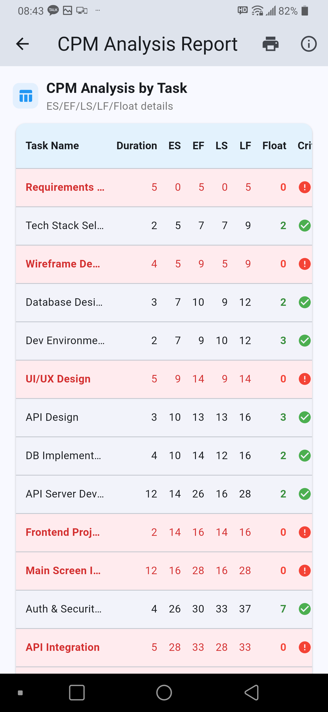
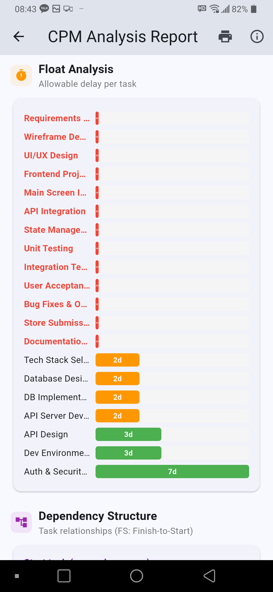
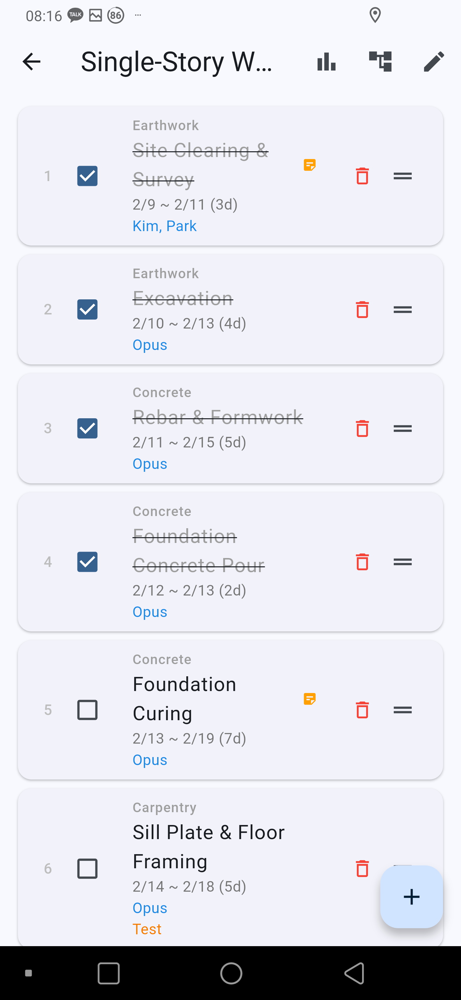
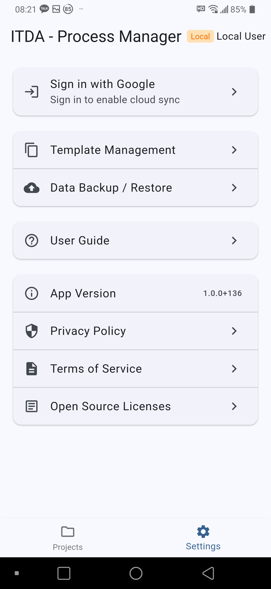

# itda

**Connect your tasks, schedules, and teams.**

"itda(잇다)" means "to connect" in Korean.
This app connects tasks to tasks, people to schedules, and plans to execution.

itda works for any project where schedules and task sequences matter — construction, software development, large-scale projects, travel & event planning, and more.

---

## Screenshots

| | | |
|:---:|:---:|:---:|
|  |  |  |
| Project List | Gantt Chart | CPM Diagram |
|  |  |  |
| CPM Report | CPM Analysis | Float Analysis |
|  |  | |
| Task List | Settings | |

---

## Key Features

### Gantt Chart
- Day / Week / Month zoom levels
- Group tasks by category (phase)
- Manual progress input for real-time tracking
- Tap a bar to view and edit task details

### CPM Diagram
- Freely arrange nodes in a network diagram
- Automatic ES/EF/LS/LF calculation
- Critical Path auto-detection (highlighted in red)
- Float analysis to spot bottlenecks early
- Auto-generated CPM analysis reports

### Export
- Gantt chart / CPM diagram PDF printing
- Gantt chart Excel (.xlsx) export
- Presentation mode supported

### Offline First
- Full functionality without internet
- Auto-sync when back online
- Use without login (local mode)
- Google Sign-In for cross-device sync

### Templates
- Built-in examples: Wood Construction, Software Development
- Create your own custom templates for reuse
- Start new projects from any template, then freely modify

### Data Backup
- Full data backup in JSON format
- Restore anytime — ideal for remote sites without internet
- Keep your data safe independently of cloud sync

---

## Download

[Google Play](https://play.google.com/store/apps/details?id=com.midasoft.itda)

---

## Links

- [Privacy Policy](privacy-policy)
- [Terms of Service](terms-of-service)

---

## Contact

midasoftapp@gmail.com

---
